# OpenTranscribe

<div align="center">

**[View Interactive Presentation](docs/slides/presentation.html)** | Animated overview of the project

</div>

<table>
<tr>
<td>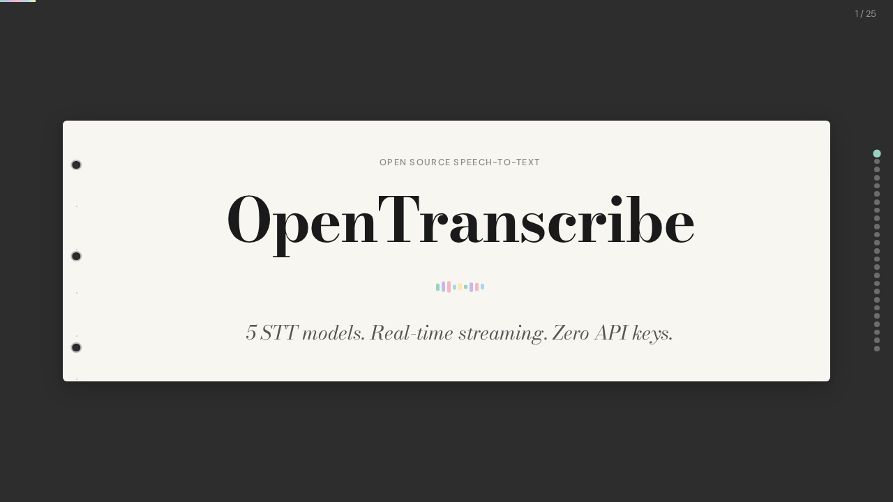</td>
<td>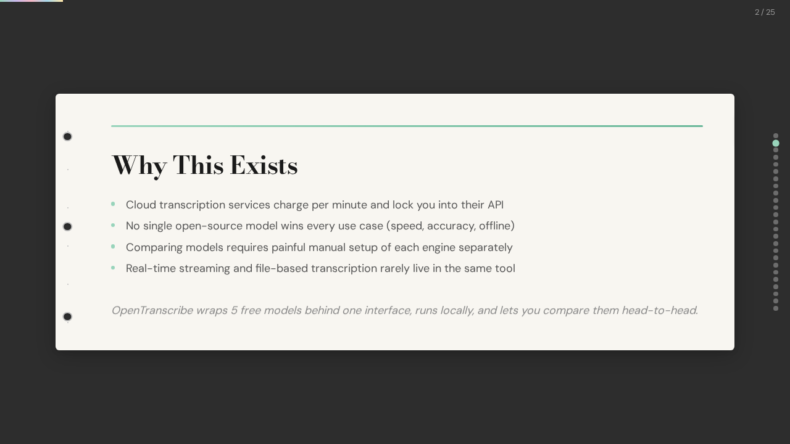</td>
</tr>
<tr>
<td>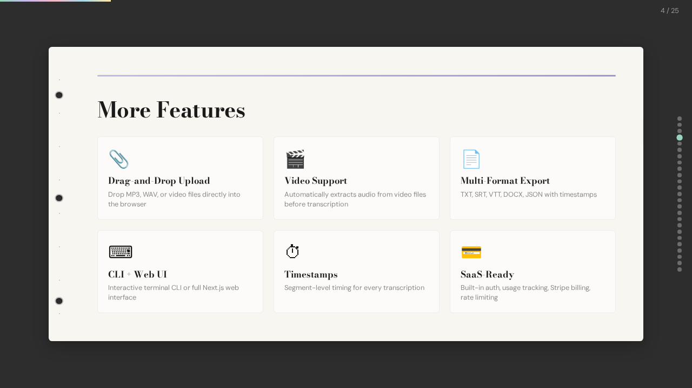</td>
<td>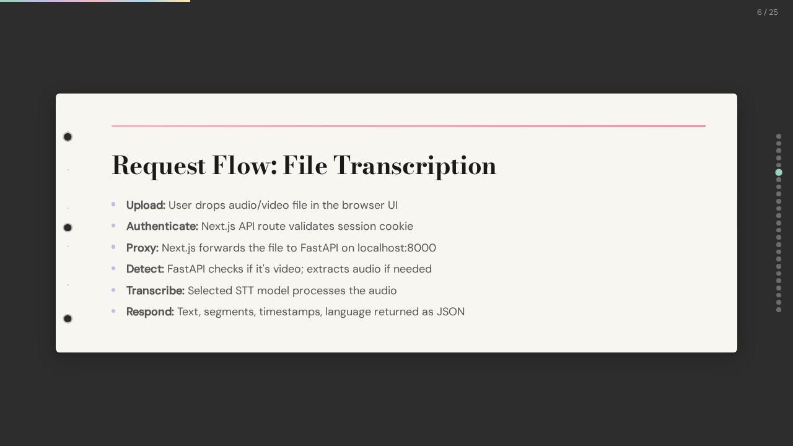</td>
</tr>
<tr>
<td>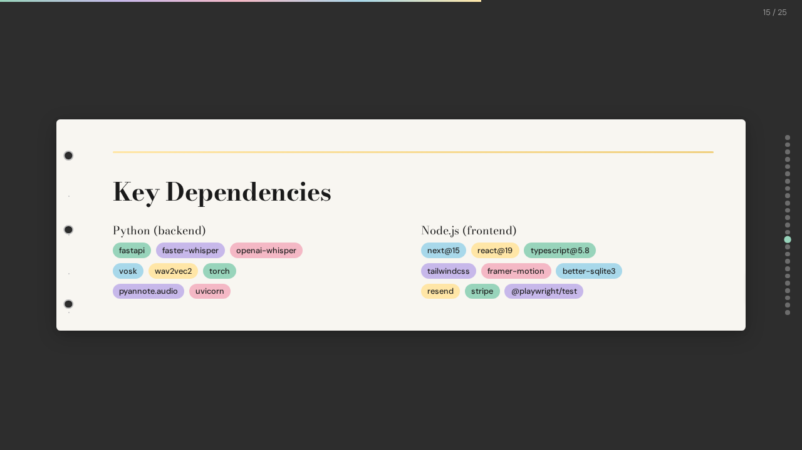</td>
<td>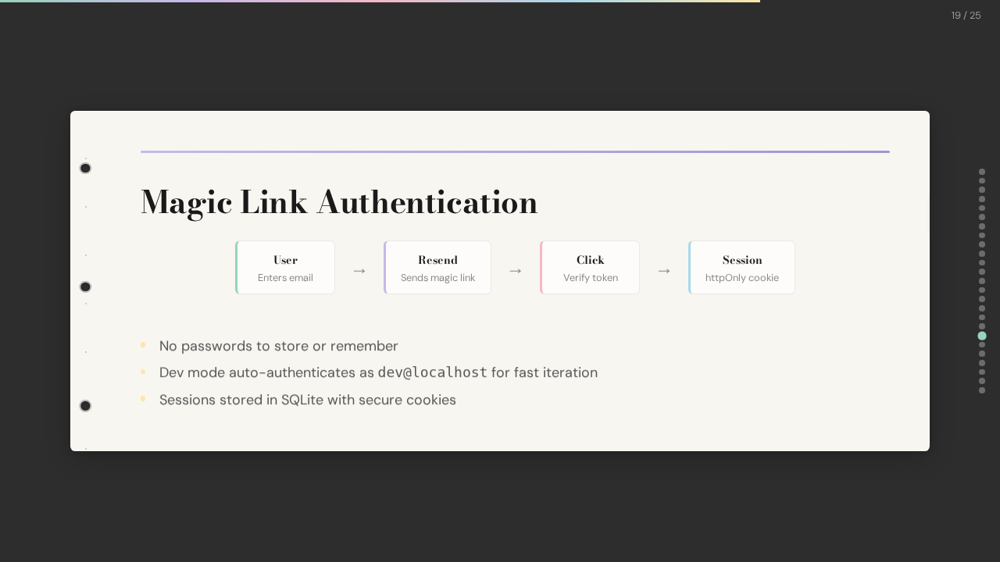</td>
</tr>
</table>

A Next.js app for transcribing audio files using multiple open-source STT models via a Python backend API.

## Features

- Drag-and-drop MP3 upload
- **5 STT Models** - Choose from Faster Whisper, OpenAI Whisper, Vosk, whisper.cpp, and Wav2Vec2
- **Model Comparison** - Compare transcription results across models with diff highlighting
- **Standalone Mode** - API server starts automatically with CLI
- Multi-language support: English, Spanish, and auto-detect
- Verbatim text output with timestamps
- Fast API backend with FastAPI

## Supported Models

| Model | Speed | Accuracy | GPU | Best For |
|-------|-------|----------|-----|----------|
| **Faster Whisper** | ⚡ Fast | ★★★★★ | Optional | Default choice, best balance |
| **OpenAI Whisper** | Medium | ★★★★★ | Optional | Original reference |
| **Vosk** | ⚡⚡ Fastest | ★★★☆☆ | No | Real-time, embedded |
| **whisper.cpp** | Slow | ★★★★★ | No | CPU-only systems |
| **Wav2Vec2** | Medium | ★★★☆☆ | Optional | Research, fine-tuning |

## Prerequisites

- **Node.js** (v18+)
- **Python** (v3.10+)
- **pip** (Python package manager)
- **NVIDIA GPU** (optional, for faster transcription)

## Setup

<!-- one-command-install -->
> **One-command install**: clone, configure, and run in a single step:
>
> ```bash
> curl -fsSL https://raw.githubusercontent.com/jasperan/opentranscribe/main/install.sh | bash
> ```
>
> <details><summary>Advanced options</summary>
>
> Override install location:
> ```bash
> PROJECT_DIR=/opt/myapp curl -fsSL https://raw.githubusercontent.com/jasperan/opentranscribe/main/install.sh | bash
> ```
>
> Or install manually:
> ```bash
> git clone https://github.com/jasperan/opentranscribe.git
> cd opentranscribe
> # See below for setup instructions
> ```
> </details>


### 1. Install Frontend Dependencies

```bash
npm install
```

### 2. Install Python Backend Dependencies

```bash
# Install all dependencies (includes all STT models)
pip install -r requirements.txt
```

### 3. Run the Application

**Standalone CLI (Recommended):**
```bash
cd backend
python cli.py
```

The CLI automatically starts the API server in the background. No separate terminal needed!

```
    ╔════════════════════════════════════════════════════════════════╗
    ║                 OPENTRANSCRIBE CLI                             ║
    ║           Multi-Model Audio Transcription Tool                 ║
    ║                                                                ║
    ║   API Server: ● Running                                        ║
    ╚════════════════════════════════════════════════════════════════╝

Select a Task:
 [1]  Transcribe Audio File
 [2]  Compare All Models
 [3]  List Available Models
 ────
 [4]  Manage API Server
 ────
 [0]  Exit
```

**Frontend (optional):**
```bash
npm run dev
```
The app will open at `http://localhost:3000`

## CLI Usage

The interactive CLI provides:
- **Transcribe Audio File** - Select any model and transcribe
- **Compare All Models** - Run multiple models and see differences
- **List Available Models** - See which models are installed
- **Manage API Server** - Start/stop/restart the server

### Model Comparison

The comparison feature runs your audio through multiple models and shows word-level differences:

```
═══════════════════════════════════════════════════════════════════════
                      MODEL COMPARISON RESULTS
═══════════════════════════════════════════════════════════════════════

┌──────────────────┬─────────┬─────────┐
│ Model            │ Time    │ Match   │
├──────────────────┼─────────┼─────────┤
│ ● Faster Whisper │ 8.74s   │ baseline│
│ ● OpenAI Whisper │ 8.58s   │ 88%     │
│ ● Vosk           │ 26.39s  │ 75%     │
└──────────────────┴─────────┴─────────┘

DIFFERENCES FOUND (130 word positions differ):
────────────────────────────────────────────────────────────────────────

Word #33: "None"
  ├─ Baseline:       None
  ├─ OpenAI Whisper: the
  └─ Vosk:           the         ✓
```

## API Endpoints

The API server runs automatically at `http://127.0.0.1:8000`

- `GET /` - API status
- `GET /health` - Health check
- `GET /models` - List available STT models
- `POST /transcribe` - Transcribe audio file
  - `file`: Audio file (multipart/form-data)
  - `model`: Model ID (optional, default: faster-whisper)
  - `language`: Language code (optional, default: auto)
- `POST /compare` - Compare multiple models
  - `file`: Audio file
  - `models`: Comma-separated model IDs (optional, default: all)

## Build for Production

### Frontend
```bash
npm run build
```
Deploy the `.next/` build output or use `npm start` to serve.

### Backend
The backend can be deployed to any Python hosting service:
- **Heroku**: Add `Procfile` with `web: uvicorn backend.main:app --host 0.0.0.0 --port $PORT`
- **Railway/Render**: Configure to run `python backend/main.py`
- **Docker**: Create a Dockerfile for containerized deployment

**Note:** Update `VITE_API_URL` environment variable in the frontend to point to your deployed backend URL.

## Supported Formats & Languages

- **Audio Formats**: MP3, WAV, and other audio formats supported by Whisper
- **Languages**:
  - English (en)
  - Spanish (es)
  - Auto-detect (automatically detects the language)

## Model Information

All models are **free and open-source** - no API keys required:

- **Faster Whisper**: CTranslate2 reimplementation, 4x faster
- **OpenAI Whisper**: Original model (~150MB for base)
- **Vosk**: Lightweight Kaldi-based (~50MB models)
- **whisper.cpp**: C++ implementation for CPU
- **Wav2Vec2**: HuggingFace Transformers

Models are cached after first download in `~/.cache/` directories.

---

## 🎨 Frontend Design

### UI Screenshots

OpenTranscribe features a **Sonic Precision** design system with warm gold on deep ink, creating an audio-grade luxury aesthetic.

#### Landing page (dark)
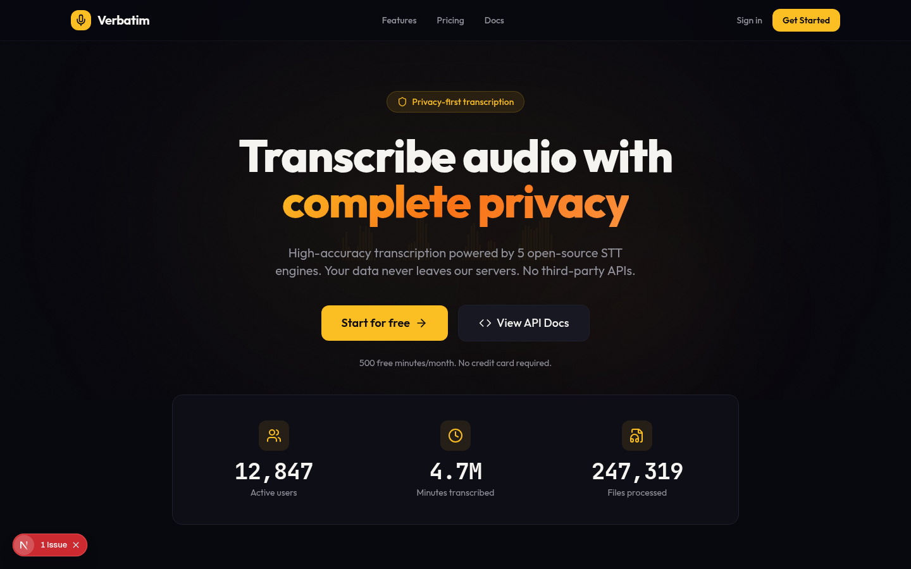

#### Landing page (light)
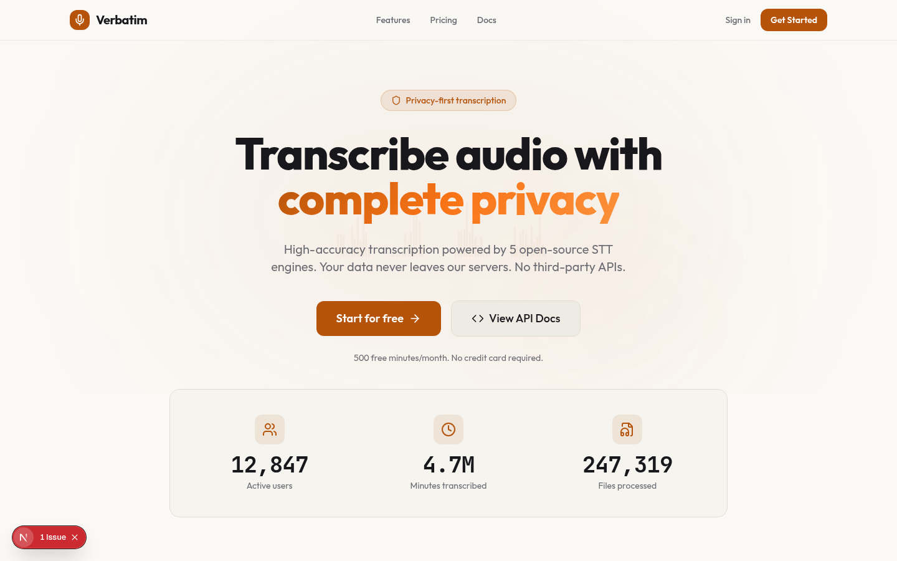

#### Features (bento grid)
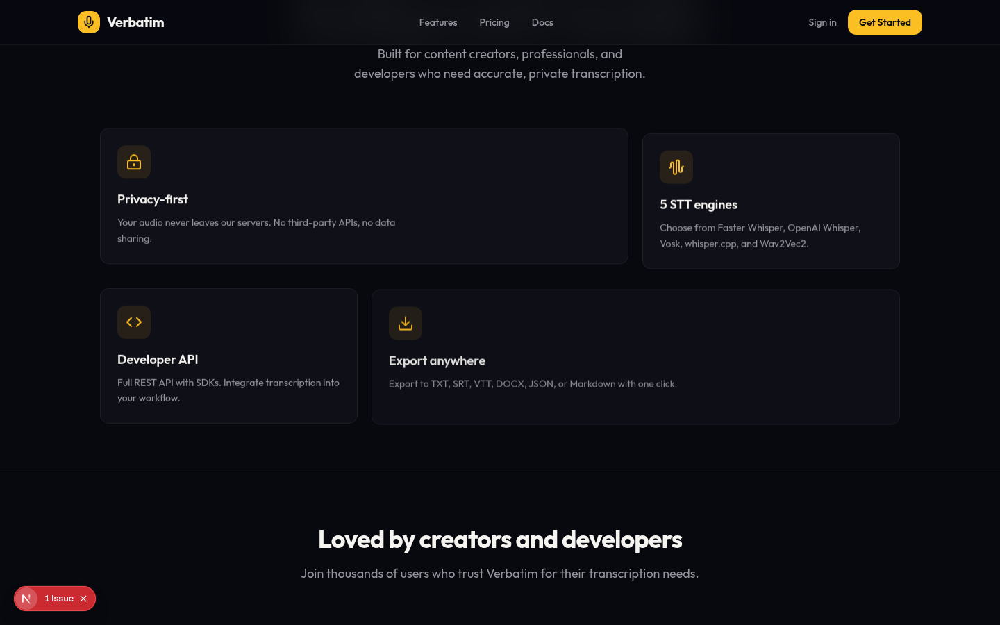

#### Pricing
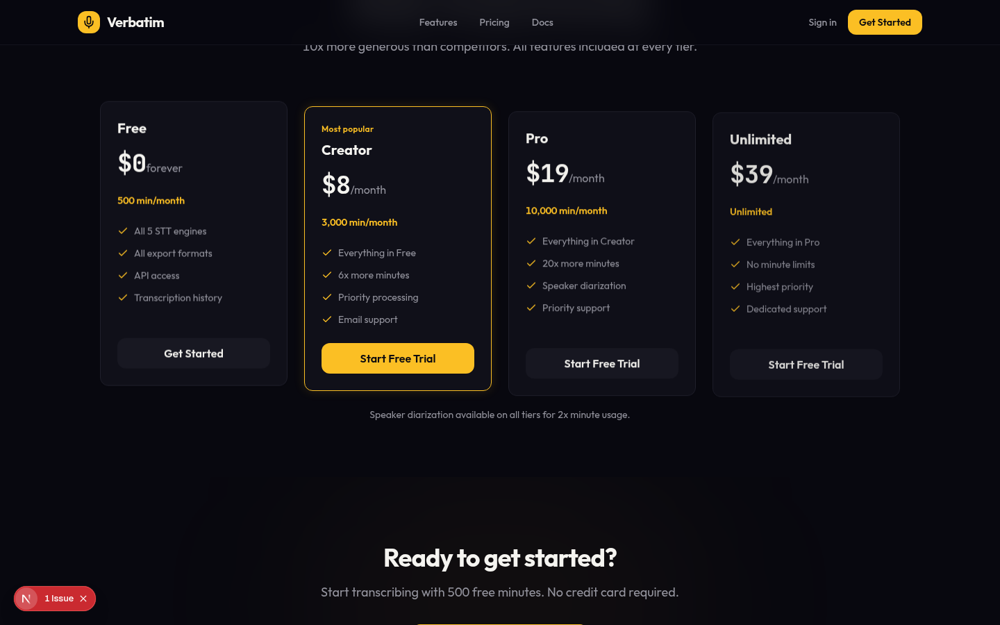

#### Login
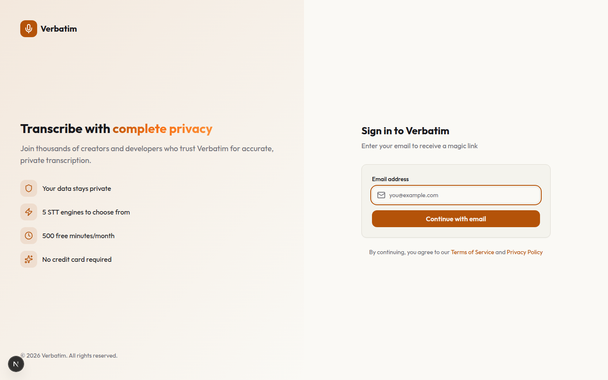

### Design System

| Component | Description |
|-----------|-------------|
| **Color Palette** | Warm gold (#FBBF24) on deep ink (#08080F), warm ivory (#FAF9F5) light mode |
| **Typography** | Outfit (sans), JetBrains Mono (code/numbers), tabular figures for data |
| **Layout** | Bento grid features, asymmetric testimonials, flex-aligned pricing |
| **Animations** | Framer Motion springs, waveform bars, staggered entry, scroll reveals |
| **Glass Effects** | Backdrop blur panels with tinted hover shadows |

### Key UI Components

1. **Upload Zone** - Drag-and-drop area with visual feedback
2. **Audio Player** - Custom waveform visualization with playback controls
3. **Model Selector** - Radio buttons for choosing STT engines
4. **Transcript Editor** - Monaco-style text editor with line numbers
5. **Diff Viewer** - Highlighted differences between model outputs
6. **Export Menu** - Format selection with preview

> **Note**: Screenshots live in `assets/screenshots/` (README gallery) and `docs/screenshots/` (full set with dark/light/mobile variants).
